# VectorMind AI

A modern AI-powered Vector Database + RAG Playground built with Python, Flask, Ollama, and custom vector search algorithms.

VectorMind AI allows you to:

* Store embeddings
* Perform semantic vector search
* Compare search algorithms
* Visualize vectors in real time
* Run Retrieval-Augmented Generation (RAG)
* Chat with local LLMs using Ollama
* Benchmark ANN search performance

# Features

## Semantic Vector Search

Search vectors using natural language queries with multiple indexing algorithms.

Supported algorithms:

* HNSW
* KD-Tree
* Brute Force

---

## Real-Time Vector Visualization

Interactive animated vector map with:

* Live movement
* Category clustering
* Glow effects
* AI search highlighting
* RAG match blinking

Categories include:

* AI / CS
* Math
* Food
* Sports
* General

---

## Local AI Chat (RAG)

Ask questions using local AI models through Ollama.

The system:

1. Searches related vectors/documents
2. Retrieves relevant context
3. Sends context to the LLM
4. Generates intelligent answers

---

## Benchmark System

Compare algorithm speed in real time.

Metrics include:

* Search latency
* ANN performance
* Similarity comparison timing

---

## Document Database

Insert documents and use them for RAG-based AI conversations.

---

## Custom Vector Database

Built completely from scratch without using FAISS or Pinecone.

Includes:

* Custom HNSW implementation
* KD-Tree search
* Vector storage
* Similarity metrics
* PCA visualization pipeline

# Tech Stack

## Backend

* Python
* Flask
* NumPy
* Ollama

---

## Frontend

* HTML
* CSS
* Vanilla JavaScript
* Canvas API

---

## AI / Embeddings

* Ollama
* Nomic Embeddings
* Local LLMs

---

## Vector Search Algorithms

* HNSW
* KD-Tree
* Brute Force Search

---

## Visualization

* PCA (Principal Component Analysis)
* Matplotlib
* Real-time Canvas Rendering


# Project Structure

```txt id="o0z8jv"
vectormind/
│
├── app.py                     # Main Flask application
├── embedding.py               # Embedding generation helper
├── requirements.txt           # Python dependencies
├── .env                       # Environment variables
│
├── core/                      # Core database + AI logic
│   ├── vector_db.py
│   ├── document_db.py
│   └── ollama_client.py
│
├── indexes/                   # Vector search algorithms
│   ├── hnsw.py
│   ├── kd_tree.py
│   └── brute_force.py
│
├── metrics/                   # Similarity metrics
│   └── metrics.py
│
├── models/                    # Data models
│   ├── vector_item.py
│   └── document_item.py
│
├── static/                    # Frontend assets
│   ├── script.js
│   └── style.css
│
├── templates/                 # HTML templates
│   └── index.html
│
├── utils/                     # Helper utilities
│   ├── chunker.py
│   ├── generator.py
│   └── pca_visualizer.py
│
├── screenshots/               # README screenshots
│
├── uploads/                   # Future upload pipeline
│
├── memory/                    # Future memory system
│
└── LICENSE
```

# Installation

## 1. Clone the Repository

```bash id="aj5q2r"
git clone <your-repository-url>
cd vectormind
```

---

## 2. Create Virtual Environment

### Windows

```bash id="m1r9zx"
python -m venv .venv
.venv\Scripts\activate
```

### Linux / macOS

```bash id="wq6t7n"
python3 -m venv .venv
source .venv/bin/activate
```

---

## 3. Install Dependencies

```bash id="fx2o1k"
pip install -r requirements.txt
```

---

# Install Ollama

Download and install Ollama from:

[Ollama Official Website](https://ollama.com?utm_source=chatgpt.com)

---

# Pull Required Models

Example:

```bash id="u2c8ev"
ollama pull llama3.2:1b
ollama pull nomic-embed-text
```

You can use any Ollama-supported model.

---

# Configure Environment Variables

Create a `.env` file in the project root:

```env id="ls7y4m"
OLLAMA_CHAT_MODEL=llama3.2:1b
EMBED_MODEL=nomic-embed-text
```

---

# Run the Application

```bash id="rv0x6p"
python app.py
```

---

# Open in Browser

```txt id="k8f3de"
http://127.0.0.1:5000
```
# Usage Guide

## Insert Vectors

Add vectors with metadata and categories directly from the UI.

Supported categories:

* CS
* Math
* Food
* Sports
* General

After insertion:

* Embeddings are generated
* Vectors are stored
* Visualization updates automatically

---

## Perform Semantic Search

1. Enter a search query
2. Select:

   * Algorithm
   * Similarity metric
   * Top-K results
3. Run search

The system highlights matched vectors in real time.

---

## AI RAG Chat

Ask questions using the RAG chat interface.

Flow:

1. User sends query
2. Related vectors/documents are retrieved
3. Context is sent to Ollama
4. AI generates response

Matched vectors blink inside the visualization map.

---

## Benchmark Algorithms

Compare search performance between:

* HNSW
* KD-Tree
* Brute Force

Metrics shown:

* Latency
* Speed
* Retrieval performance

---

## Insert Documents

Add long-form documents into the document database.

Documents are chunked and embedded automatically for RAG retrieval.

# Search Algorithms

## HNSW (Hierarchical Navigable Small World)

Fast approximate nearest-neighbor search algorithm optimized for large-scale vector retrieval.

### Advantages

* Extremely fast
* Scales well
* Best for production systems

### Used For

* Primary semantic search engine
* Real-time vector retrieval

---

## KD-Tree

Tree-based spatial partitioning algorithm.

### Advantages

* Efficient for lower dimensions
* Simple and lightweight

### Limitations

* Performance decreases in high-dimensional embeddings

---

## Brute Force

Linear similarity comparison against every vector.

### Advantages

* Exact results
* Simple implementation

### Limitations

* Slow for large datasets

### Used For

* Benchmark comparison
* Accuracy reference

# Similarity Metrics

VectorMind AI supports multiple similarity metrics for semantic search.

---

## Cosine Similarity

Measures angle similarity between vectors.

### Best For

* Semantic embeddings
* NLP applications
* Text similarity

---

## Euclidean Distance

Measures straight-line distance between vectors.

### Best For

* Spatial vector comparisons
* Numerical feature spaces

---

## Dot Product

Measures vector alignment magnitude.

### Best For

* Embedding ranking
* Neural retrieval systems

# Vector Visualization System

VectorMind AI includes a real-time animated vector visualization engine built using the HTML Canvas API.

---

## Features

* Live vector movement
* Animated glow effects
* Category clustering
* Connection rendering
* Search result highlighting
* RAG match blinking
* Dynamic vector updates

---

## PCA Projection

High-dimensional embeddings are reduced into 2D space using PCA (Principal Component Analysis).

This allows semantic relationships between vectors to be visualized interactively.

---

## Category Colors

| Category | Color  |
| -------- | ------ |
| CS       | Purple |
| Math     | Cyan   |
| Food     | Green  |
| Sports   | Yellow |
| General  | White  |

---

## Animation Engine

The visualization system uses:

* `requestAnimationFrame`
* Canvas rendering
* Real-time particle movement
* Dynamic glow gradients
* Connection graph rendering

# API Endpoints

## System Status

```http id="a4n8zc"
GET /status
```

Returns:

* Server status
* Ollama status
* Vector count
* Document count

---

## PCA Visualization Data

```http id="x9k2ve"
GET /pca
```

Returns vector coordinates used for visualization.

---

## Semantic Search

```http id="t7q1jh"
GET /search
```

### Query Parameters

| Parameter | Description       |
| --------- | ----------------- |
| q         | Search query      |
| algo      | Search algorithm  |
| metric    | Similarity metric |
| k         | Top-K results     |

---

## Insert Vector

```http id="n2m6pr"
POST /insert-vector
```

### Request Body

```json id="u8b3fd"
{
  "metadata": "Artificial Intelligence",
  "category": "cs"
}
```

---

## Insert Document

```http id="j6y0lt"
POST /doc/insert
```

### Request Body

```json id="q5w2sx"
{
  "title": "AI Notes",
  "text": "Large document text..."
}
```

---

## AI Chat (RAG)

```http id="e3r7vk"
POST /chat
```

### Request Body

```json id="d9n1ca"
{
  "message": "Explain semantic search"
}
```

---

## Benchmark Algorithms

```http id="m4t8qo"
GET /benchmark
```

Returns benchmark timings for all search algorithms.

# Screenshots

## Home Dashboard

```md id="a1b2c3"
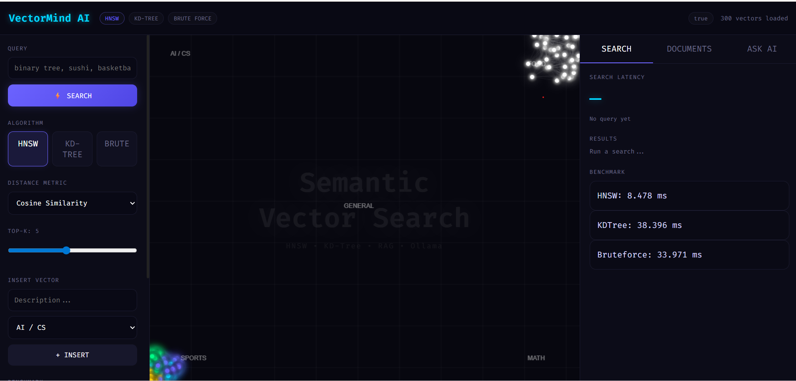
```

```md id="d4e5f6"
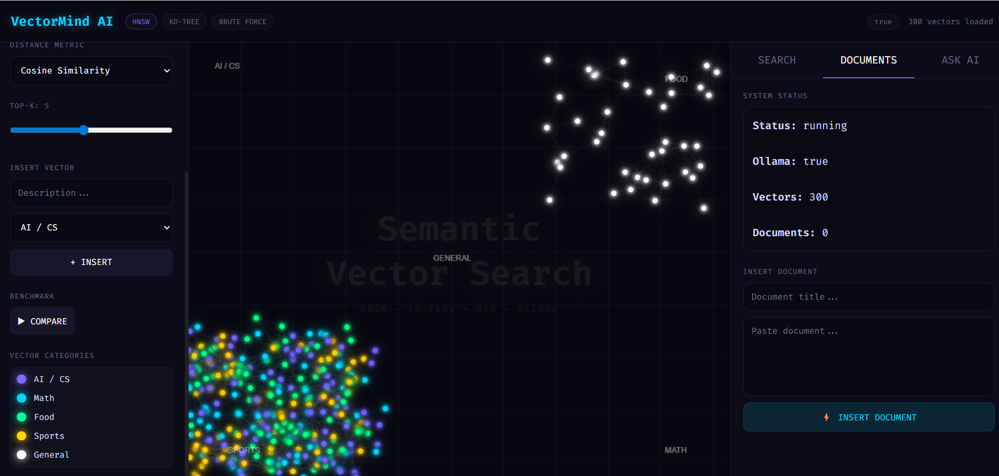
```

---

## Semantic Search

```md id="g7h8i9"
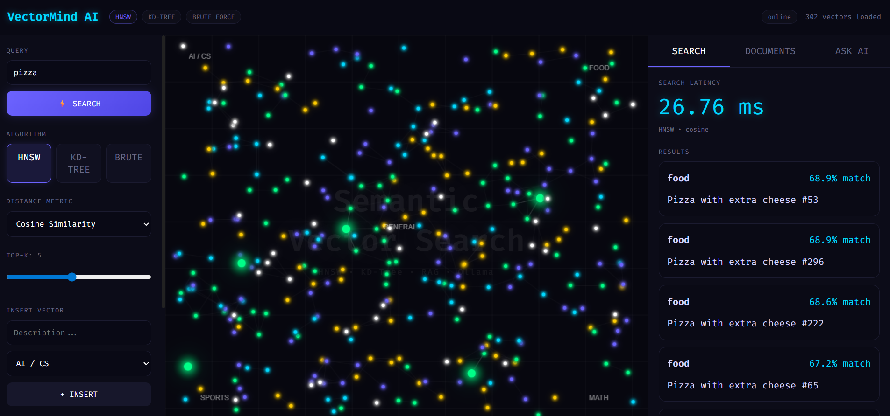
```

---

## Vector Visualization

```md id="j1k2l3"
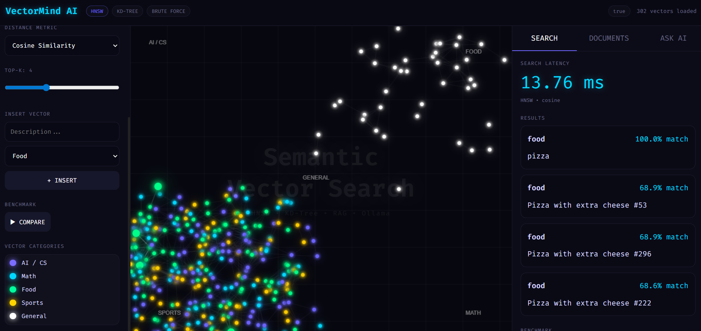
```

```md id="m4n5o6"
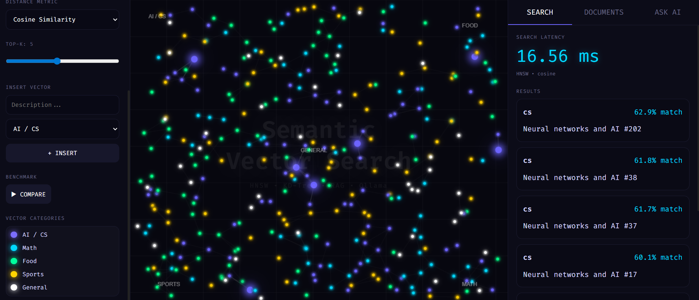
```

---

## Insert Vector

```md id="p7q8r9"
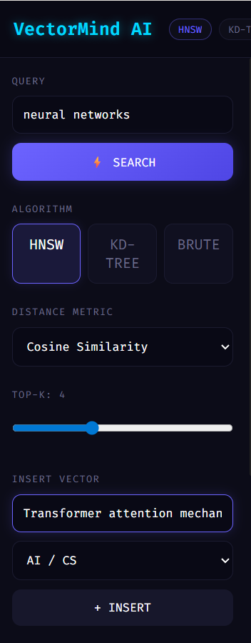
```

```md id="s1t2u3"
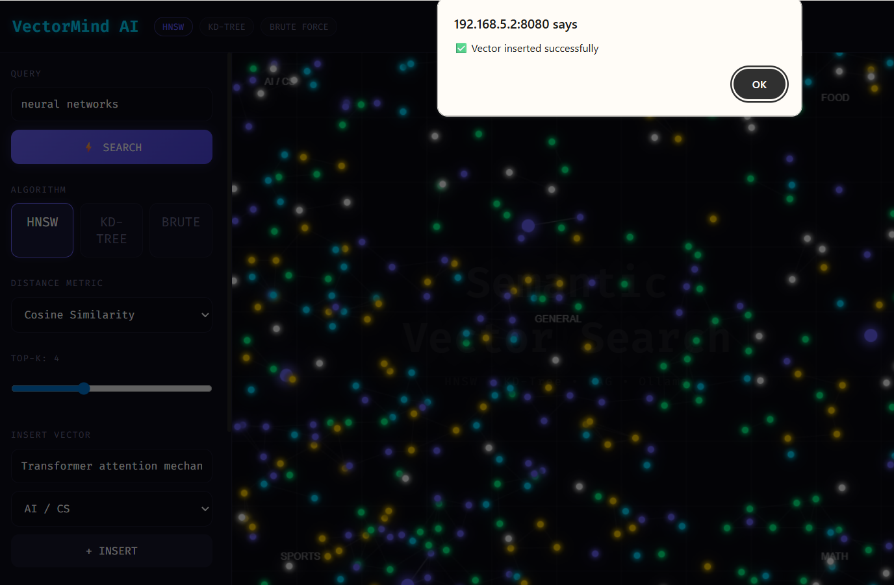
```

---

## Document RAG

```md id="v4w5x6"
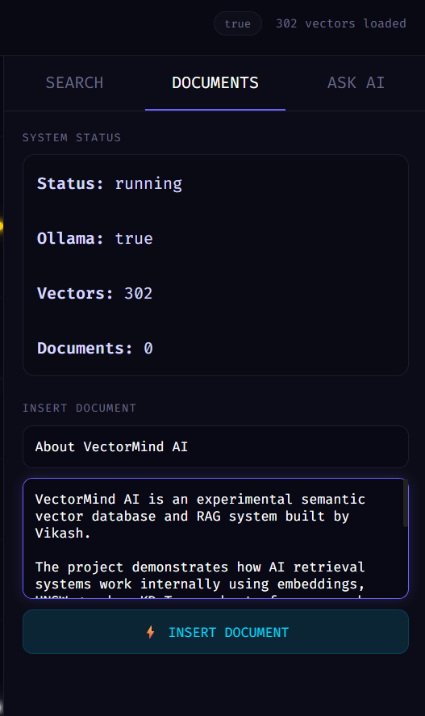
```

```md id="y7z8a9"
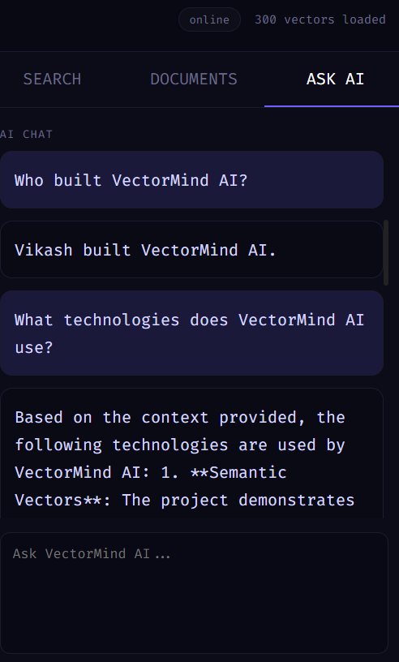
```

---

## RAG Chat

```md id="b1c2d3"
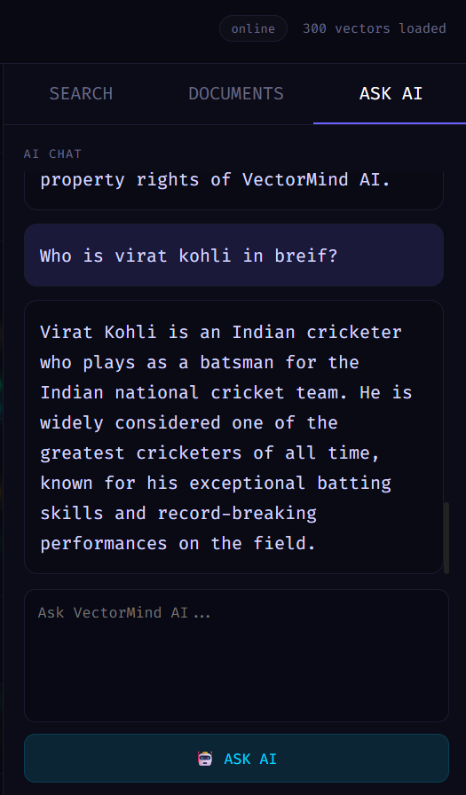
```

---

## Benchmark System

```md id="e4f5g6"
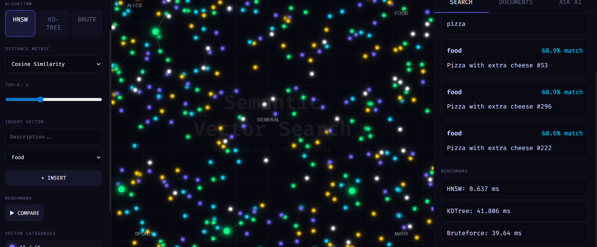
```

# Future Improvements

## Planned Features

* PDF document upload support
* Persistent vector storage
* User authentication
* Multi-user memory system
* Streaming AI responses
* Hybrid search
* GPU acceleration
* Vector filtering
* Distributed indexing
* Audio embeddings
* Image embeddings
* Advanced analytics dashboard

---

## Upload Pipeline

The `uploads/` directory is reserved for future document upload support.

Planned supported formats:

* PDF
* DOCX
* TXT
* Markdown

---

## Memory System

The `memory/` directory is reserved for future conversational memory support.

Future goals:

* Long-term AI memory
* Personalized retrieval
* Session persistence
* Multi-session context handling

# Performance Notes

## HNSW

HNSW is the fastest and most scalable algorithm in the project.

### Best For

* Large vector datasets
* Real-time semantic search
* Production-grade ANN retrieval

### Advantages

* Very fast retrieval
* High scalability
* Strong accuracy/performance balance

---

## KD-Tree

KD-Tree performs well in lower-dimensional vector spaces.

### Best For

* Small datasets
* Low-dimensional embeddings
* Educational visualization

### Limitations

* Performance decreases in high dimensions

---

## Brute Force

Brute force compares every vector directly.

### Best For

* Exact similarity matching
* Accuracy validation
* Benchmark comparison

### Limitations

* Slow on large datasets

---

# Recommended Default Setup

| Component         | Recommendation |
| ----------------- | -------------- |
| Search Algorithm  | HNSW           |
| Similarity Metric | Cosine Similarity |
| Embedding Model   | nomic-embed-text |
| LLM               | llama3.2:1b         |

---

# Optimization Tips

* Use HNSW for large datasets
* Keep embeddings normalized
* Avoid brute force on huge collections
* Use cosine similarity for text embeddings
* Limit Top-K results for faster retrieval

# Contributing

Contributions are welcome.

If you would like to improve VectorMind AI:

1. Fork the repository
2. Create a feature branch
3. Commit your changes
4. Push to your fork
5. Open a pull request

---

# Development Ideas

Possible contribution areas:

* New ANN algorithms
* Better visualization systems
* GPU acceleration
* Advanced RAG pipelines
* Persistent vector databases
* Streaming responses
* File upload system
* Multi-modal embeddings

---

# Coding Style

* Keep functions modular
* Use clear naming conventions
* Add comments for complex logic
* Maintain readable formatting
* Follow existing project structure

# License

This project is licensed under the MIT License.

You are free to:

* Use
* Modify
* Distribute
* Private use
* Commercial use

Under the conditions of the MIT License.

See the `LICENSE` file for more details.


